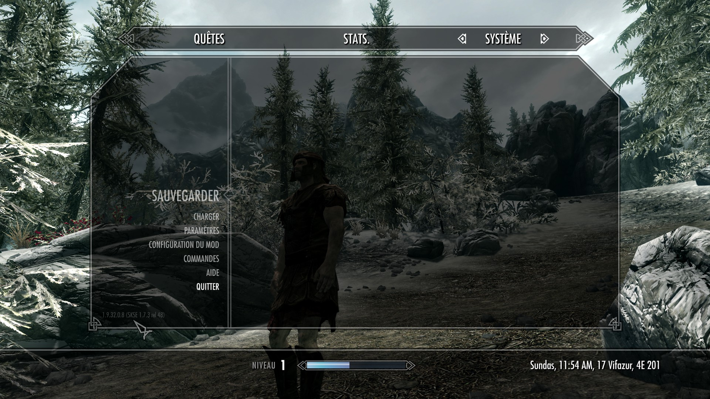

# The Elder Scrolls V : Skyrim (vanilla ou special edition)

## Installation sur linux (ubuntu 20.04)

### Steam (special edition uniquement)

Ajoutez l'option
*WINEDLLOVERRIDES="xaudio2_7=n,b" PULSE_LATENCY_MSEC=90 %command%* dans les
options de lancement.

### Liste de mods

#### Mods nécessitant des actions supplémentaires

##### SKSE

- [S'abonner](https://store.steampowered.com/app/365720/Skyrim_Script_Extender_SKSE/) au mod dans steam.
- Attendre que le mod s'installe via steam.
- Se déplacer dans le dossier principal du jeu (`/path/to/steamapps/common/Skyrim`) et renommer le
fichier `skse_loader.exe` en `SkyrimLauncher.exe`
- Testez en lançant le jeu (`Skyrim`) via steam. En lançant une partie et en faisant `Échap`, vous
devriez voir l'interface qui vous informe (en bas à gauche) de votre version de SKSE.



##### SkyUI

- [S'abonner](https://steamcommunity.com/sharedfiles/filedetails/?id=8122) au mod dans steam
- Attendre que le mod s'installe via steam.
- Ouvrir le fichier `/path/to/steamapps/compatdata/72850/pfx/drive_c/users/steamuser/Local Settings/Application Data/Skyrim/plugins.txt`
Notez que `72850` est l'identifiant steam du jeu Skyrim.

```text
Dawnguard.esm
Dragonborn.esm
HearthFires.esm
HighResTexturePack01.esp
HighResTexturePack02.esp
HighResTexturePack03.esp
SkyUI.esp  <-- Ajoutez cette ligne. / Add this line.
unreadbooksglow.esp

```


#### Autres mods installés sans steam


- [Augmente le cap maximal de vol à la tire jusqu'à 100](100 percent Max Pickpocket Chance)
- [Détecter les livres non lus]()