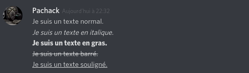
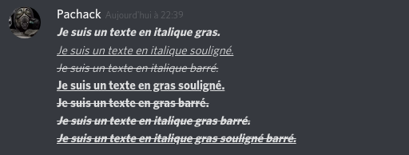
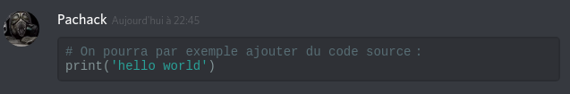
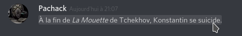
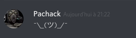

# Discord

La somme de toutes les informations glanées un peu partout.

## Contenu textuel

### Emphase du texte

D'une manière générale, le texte s'affiche en utilisant le style [Markdown](/../../langages/markdown/markdown.md).

Écrire ces lignes donnera ces effets :

```text
Je suis un texte normal.
*Je suis un texte en italique.*
**Je suis un texte en gras.**
~~Je suis un texte barré.~~
__Je suis un texte souligné.__
```



Des combinaisons de styles sont également possibles. Par exemple :

```text
***Je suis un texte en italique gras.***
__*Je suis un texte en italique souligné.*__
~~*Je suis un texte en italique barré.*~~
__**Je suis un texte en gras souligné.**__
~~**Je suis un texte en gras barré.**~~
__~~***Je suis un texte en italique gras souligné barré.***~~__
```



Markdown semble être plus ou moins implémenté dans le logiciel.

```python
# On pourra par exemple ajouter du code source :
print('hello world')
```



### Spolier / divulgâchis

```text
/spoiler À la fin de *La Mouette* de Tchekhov, Konstantin se suicide.
```


Il suffira de cliquer sur le texte pour l'afficher. 



## Commandes

Commande | Effet | Exemple | Résultat
-------- | ----- | ------- | ---
/me      | Met le texte en italique | /me Je suis un texte mis en italique par une commande. |  
/nick | Change votre pseudo | /nick toto | 
/shrug | Émoticône shrug | /shrug | 
/tableflip | Émoticône tableflip | /tableflip | 
/unflip | Émoticône unflip | /unflip | 


## Liens utiles

