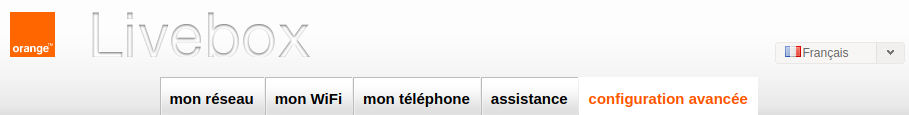
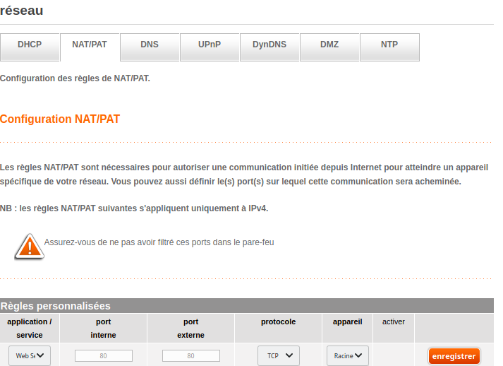

# Administration de la livebox

## Rediriger des données de l'extérieur vers une machine (*redirection de ports* / *portforwarding*)

Depuis une machine connectée à votre *livebox*, lancez votre navigateur et allez à l'adresse suivante :
[http://192.168.1.1/homeAuthentication.html](http://192.168.1.1/homeAuthentication.html).

Renseignez votre mot de passe admin pour accéder à l'interface. Dans le menu du haut, choisissez *configuration avancée*.

Puis, dans le sous-menu, cliquez sur *NAT/PAT*. Vous pouvez désormais créer de nouvelles règles de redirection.
Par exemple, vous aurez besoin de créer une nouvelle règle dans le tableau (donnez-lui un nom) et d'y notifier le port
que vous avez choisi précédemment (*25565* si vous avez choisi comme moi). En protocole, c'est le TCP qui vous intéresse.
Enfin, choisissez vers quelle machine (votre serveur donc) la box redirigera les données. Pensez à vérifier que la case
d'activation est bien cochée et enregistrez.

