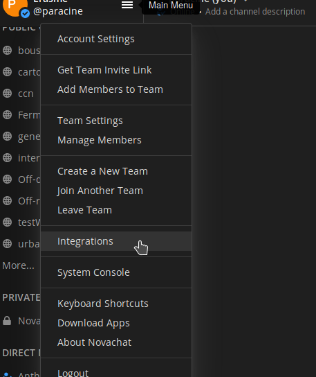
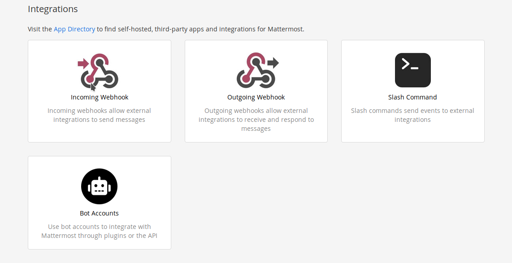
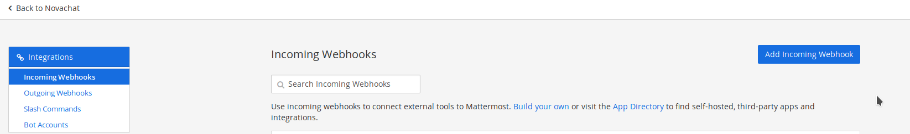
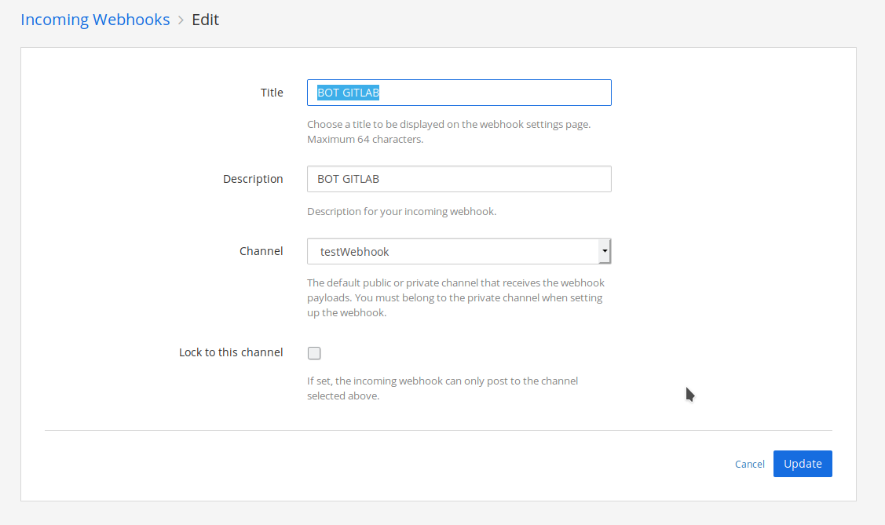
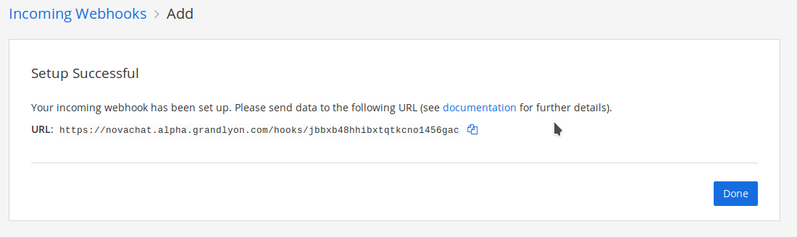
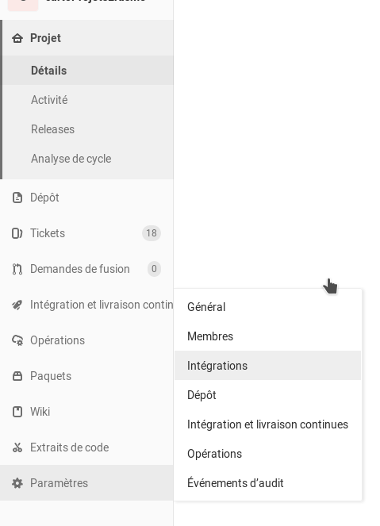
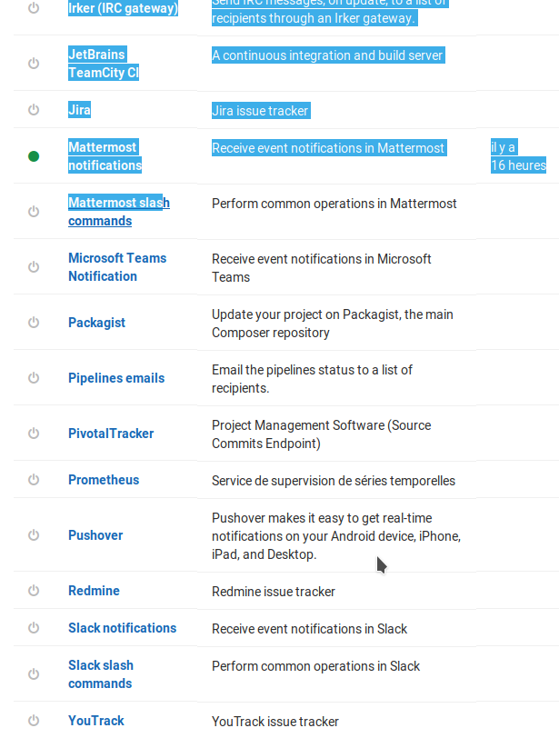
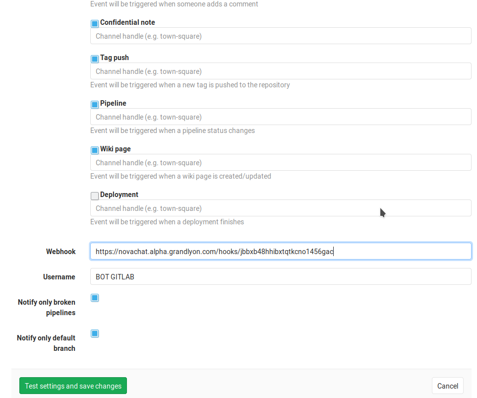

# Mattermost

## Intégrer un webhook Gitlab

*Objectif :* Mettre en place un lien entre un dépôt Gitlab et un canal Mattermost. Chaque fois qu'une opération (choisie
à l'avance) sera effectuée sur le dépôt, un message sera publié sur un canal Mattermost choisi.

### Créer un webhook entrant

Dans le menu de Mattermost, allez sur la page « ___Intégration___ ».

Choisissez l'option « ___Incoming Webhook___ ».

Et cliquez sur « Add Incoming Webhook ».

Remplissez les informations du webhook.

Une fois validés, ces paramètres vous créeront un webhook qui écoutera le lien marqué sur la page suivante :

Copiez ce lien ! Il vous sera redemandé. Si vous le perdez, recommencez les étapes jusqu'à l'étape « Add incoming
Webhook ». Vous y retrouverez la liste de tous ceux déjà créés.

### Créer un webhook sortant

Mattermost est donc prêt à écouter, il faut à présent que Gitlab lui envoie des messages.

Sur gitlab, allez sur la page d'un projet puis, choisissez l'option « Intégrations » du menu « Paramètres ».

Descendez tout en bas de la page, vous verrez que de nombreux services sont d'ores et déjà proposés par Gitlab.

Commencez par cocher la case « Active » afin de rendre actif le webhook.

Puis une succession de cases à cocher correspondant aux évènements déclenchant les messages. Cochez celles qui vous
semblent pertinentes.

Enfin, mettez le lien du webhook qui vous a été fourni par Mattermost et choisissez le nom du Bot qui écrira ce message.

Si tout se passe bien, dès que vous sauvegarderez, un test sera fait egt enverra un message sur le canal.

