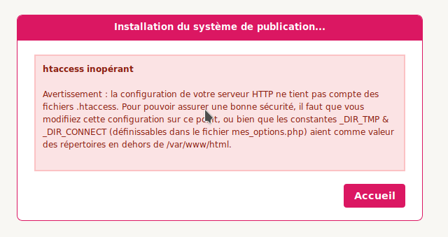
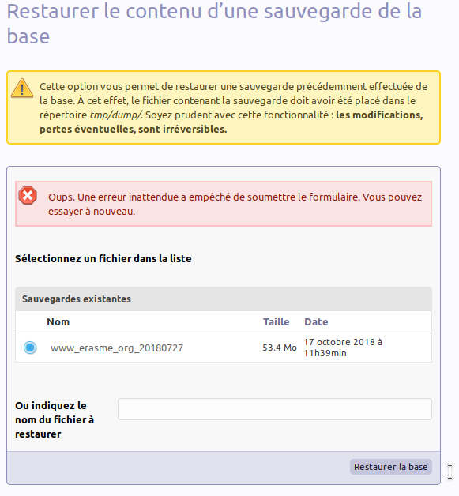
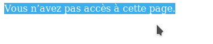

# SPIP

- [Astuces pour coder](#astuces-pour-coder)
- [Problèmes rencontrés durant l'utilisation de SPIP](#Problèmes-rencontrés-durant-lutilisation-de-SPIP)
  * [Page blanche durant l'installation](#Page-blanche-durant-linstallation)
  * [htaccess inopérant](#htaccess-inopérant)
  * [Erreur lors d'un import de dump](#Erreur-lors-dun-import-de-dump)
  * [Mettre à jour SPIP via le spip_loader.php](#Mettre-à-jour-SPIP-via-le-spip_loader.php)
- [Astuces diverses](#astuces-diverses)
  * [Créer sa propre balise](#crer-sa-propre-balise-du-genre-ma_balise) 
- [Astuces des modules](#astuces-des-modules)
  * [Champs Extra](#champs-extra)

## Astuces pour coder

### Récupérer l'url absolue d'un logo ou d'une image

Dans certains cas, il nous faut l'url complète d'une image. La seule solution consiste à passer
par une succession de filtres pour l'en extraire :

```html
<!-- Ici, nous créons un div ayant comme arrière-plan une image dont nous récupérons l'url absolue.  -->
<div
    <BOUCLE_image(ARTICLES){id_article=XXX}>
    style="
        background: url('[(#LOGO_ARTICLE|extraire_attribut{src}|url_absolue)]') no-repeat;
        background-size: cover;"
    </BOUCLE_proto>
>
    texte par-dessus l'image
</div>
```

### Faire une condition (if) en SPIP

SPIP peut être particulièrement pénible lorsqu'on tente de coder de manière procédurale. Une simple
condition nécessite de tirailler SPIP dans tous les sens.

```html
<!--
Ici, nous souhaitons afficher les rubriques 3 par 3.
Pour ce faire, nous parcourons toutes les rubriques et jouons avec le modulo du compteur de la boucle.
Si le modulo par 3 du compteur est égal à 1, on affiche une balise <div> ouvrante.
Alors que si le modulo par 3 du compteur est égal à 0, on affiche une balise <div> fermante.
 -->
<BOUCLE_rubriques(RUBRIQUES){id_rubrique=XXX}{par id_rubrique}>
    [(#COMPTEUR_BOUCLE|modulo{3}|=={1}|oui)
        <div class="ouvrant">
    ]
        mon contenu ici
    [(#COMPTEUR_BOUCLE|modulo{3}|=={0}|oui)
    </div>
    ]
</BOUCLE_rubriques>
```


## Problèmes rencontrés durant l'utilisation de SPIP


#### Page blanche durant l'installation

Vérifiez dans les logs d'apache situés en /var/log/apache2/error.log :

```bash
cat /var/log/apache2/error.log
```

Si vous avez l'erreur suivante, c'est que php-xml-htmlsax n'est pas installée. Il s'agit habituellement d'une dépendance
de php-xml mais elle ne s'installe pas toujours en fonction du contexte. 

**_Problème :_**

```text
PHP Fatal error:  Uncaught Error: Call to undefined function xml_parser_create() in /var/www/html/nomDuSite/ecrire/xml/sax.php
```

**_Solution :_**

```bash
sudo apt-get install php-xml-htmlsax3
```

#### htaccess inopérant

**_Problème :_**



**_Solution :_**

Renommez simplement le htaccess de l'application.

```bash
sudo mv /var/www/html/nomDuSite/htaccess.txt /var/www/html/nomDuSite/.htaccess 
```

### Erreur lors d'un import de dump

**_Problème_**

Si vous avez une erreur du type :
```text
Oups. Une erreur inattendue a empêché de soumettre le formulaire. Vous pouvez essayer à nouveau.
```




**_Solution_**

Il vous manque le module sqlite de PHP, (ré)installez-le :

```bash
sudo apt-get install sqlite php-sqlite3 libsqlite3-dev
```


### Mettre à jour SPIP via le spip_loader.php

**_Problème_**

Si vous avez l'erreur ___Vous n’avez pas accès à cette page.___ en appelant le fichier spip_loader.php, c'est que vous
ne vous êtes pas rajouté dans la liste des utilisateurs ayant le droit de faire cette mise à jour.



**_Solution_**

Allez dans l'[interface d'administration de SPIP](http://localhost/ccn/air/ecrire/?exec=auteurs) et récupérez-y votre
identifiant d'utilisateur (un nombre).

Puis vérifiez que le fichier ___spip_loader.php___ se trouve bien à la racine de votre site (aux côtés de *spip.php* et
*spip.png*). Ouvrez-le et modifiez la ligne suivante :

```php
if (!defined('_SPIP_LOADER_UPDATE_AUTEURS')) {
	define('_SPIP_LOADER_UPDATE_AUTEURS', '1:VOTRE_IDENTIFIANT_UTILISATEUR');
    // Notez la présence des deux points « : » entre les différents nombres.
}
```

La variable __SPIP_LOADER_UPDATE_AUTEURS_ contient la liste des utilisateurs ayant le droit d'appliquer la mise à jour.
Ces utilisateurs sont représentés par leurs identifiants séparés par « : »

# Astuces diverses

Pages tierces listant eux-mêmes des astuces :
- [« Astuces courtes »](https://contrib.spip.net/Astuces-courtes-pour-SPIP)
- [« Astuces longues »](https://contrib.spip.net/Astuces-longues-pour-SPIP)


## Créer sa propre balise (du genre #MA_BALISE)

Voir [cette page](https://code.spip.net/fr/archives/compilateur/article/creer-des-balises-personnalisees-9).

## Voir l'agencement des squelettes dans une page

Dans l'url de votre navigateur, ajoutez l'option :

```text
&var_mode=inclure
```

Vous aurez ainsi un affichage de page vous indiquant la provenance de chaque portion de code.


# Astuces des modules

## paquet.xml

POur tout savoir sur `paquet.xml`, une documentation officielle existe [ici](https://plugins.spip.net/redaction-du-paquet-xml.html).

## Champs extra

### Accéder aux champs extra sans interface

Le module _champs extra_ peut être utiisé sans interface. Dans ce cas, on peut déclarer, paramétrer et retrouver
tout ce qui concerne les champs extra dans un fichier qui aura été déclaré. 

### Récupérer la valeur d'un champ extra

Vous avez créé un champ extra et souhaitez à présent vous en servir dans un de vos squelettes SPIP.

Admettons qu'il soit déclaré comme avec pour identifiant _id_linked_rub_ dans vos fichiers.
POur l'utiliser dans un squelette, vous pouvez l'insérer dans votre code avec _#ID_LINKED_RUB_. 


### Restreindre des champs à certaines rubriques

Ajoutez cette ligne au fichier functions.php qui aura été déclaré :

```php
restreindre_extras('article', array($tableauDesIdentifiantsDesChampsConcernes), array(308), 'rubrique', true);
``` 
Cette ligne restreindra les champs de $tableauDesIdentifiantsDesChampsConcernes à la rubrique 308.

[La documentation de cette fonction](https://contrib.spip.net/Champs-Extras-3-API-et-creations)