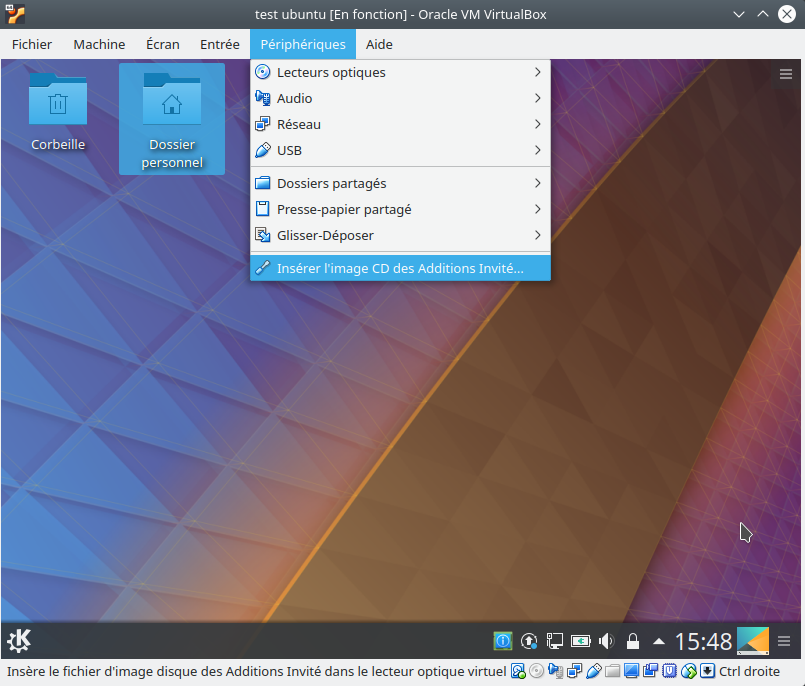
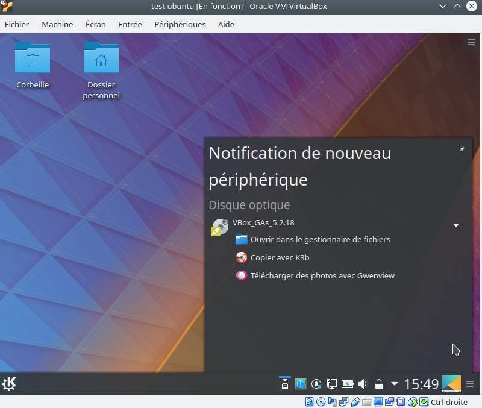
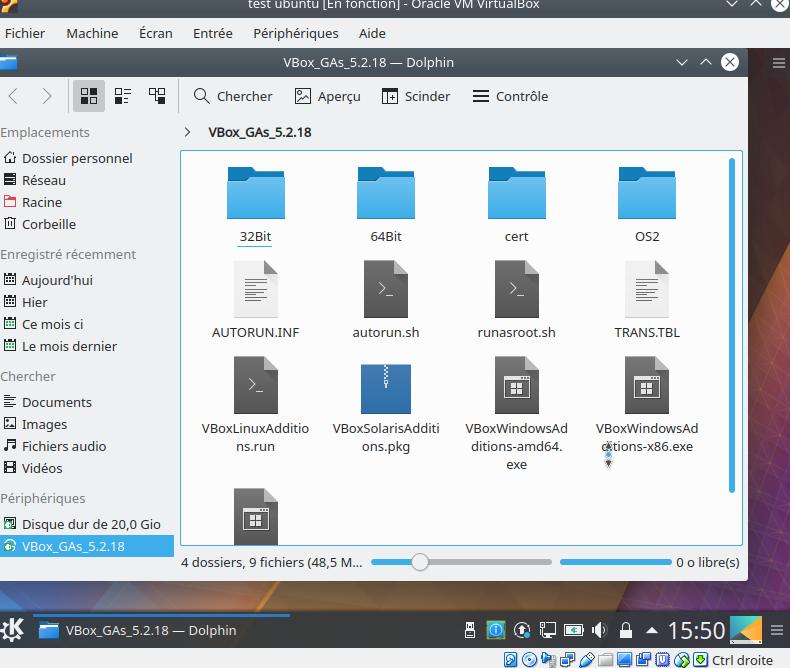
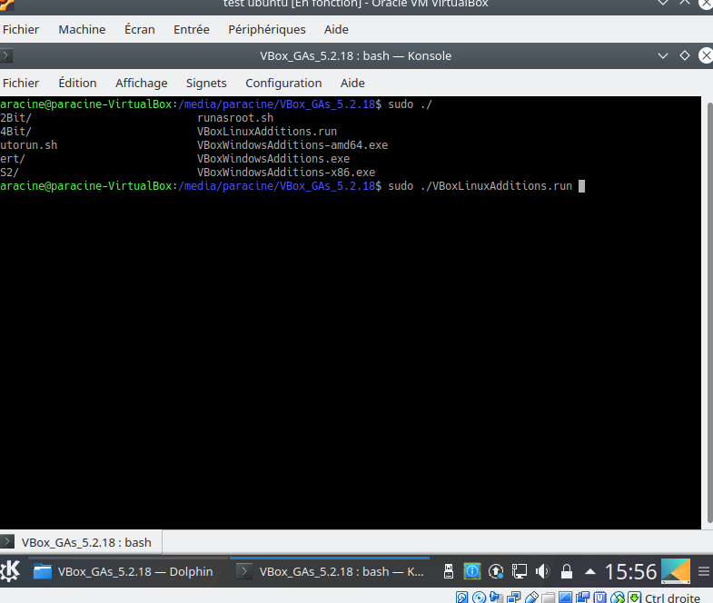
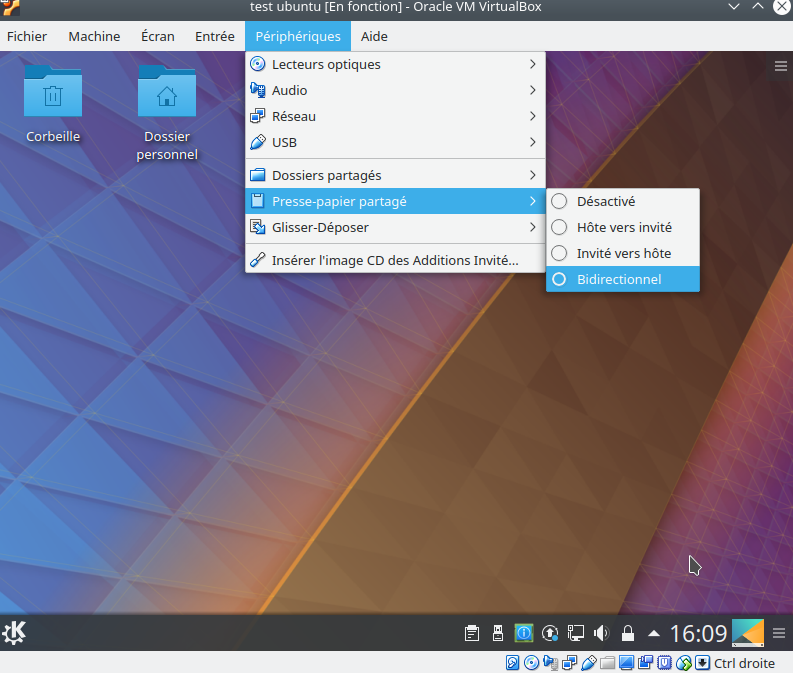
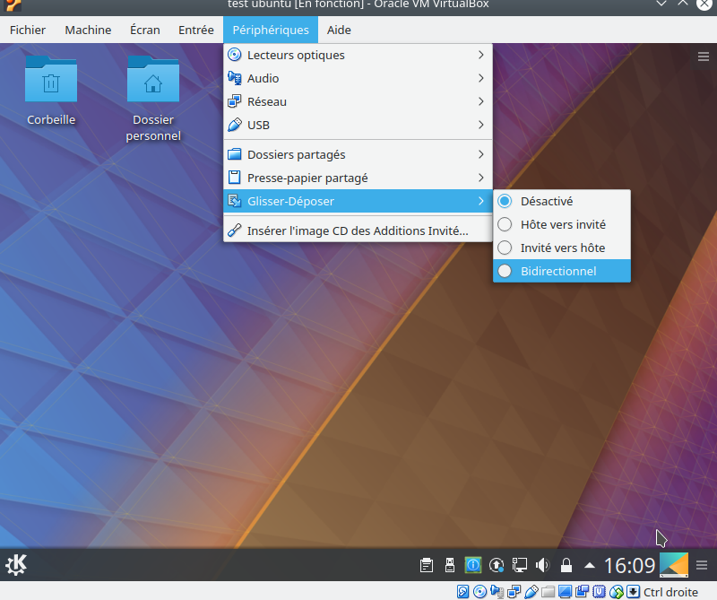
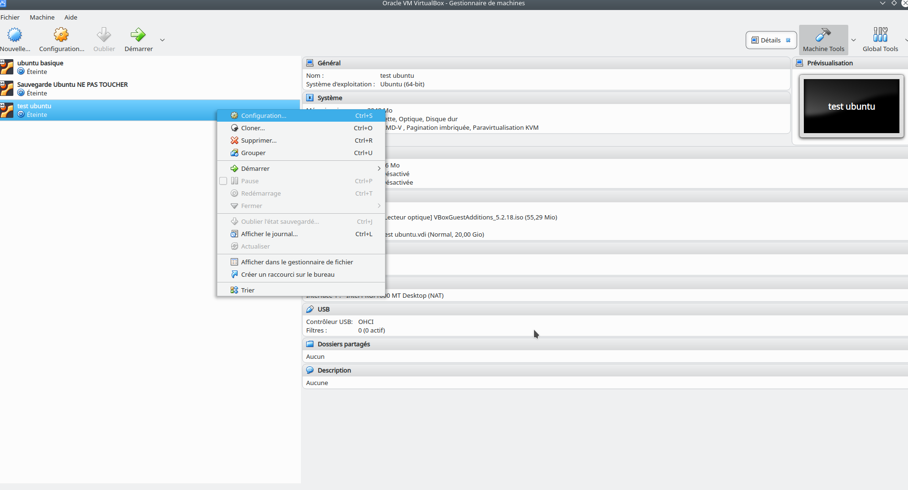
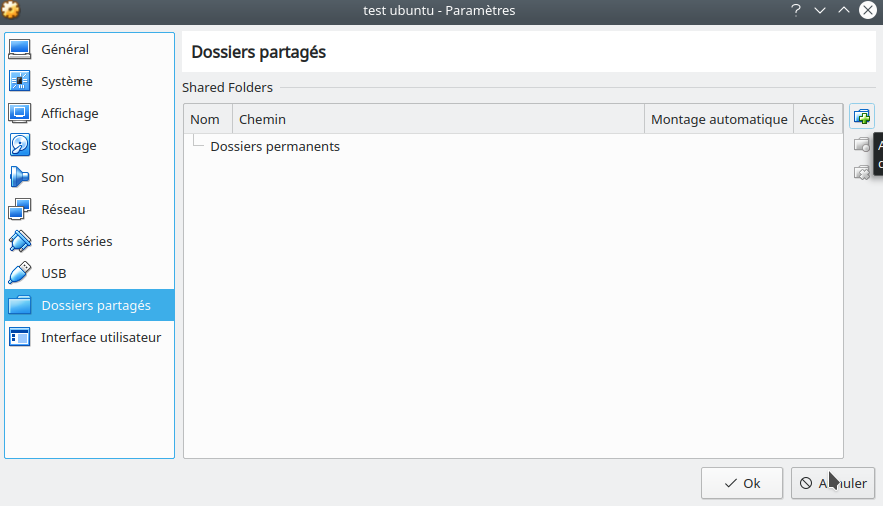
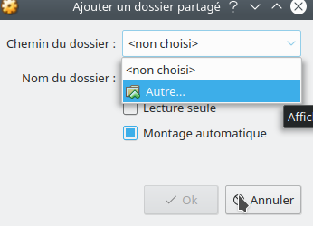

# VirtualBox

Dans cette page, il faut bien distinguer le terme de machine-hôte de celle de machine invitée.

+ La machine-hôte est le système de votre machine.
+ La machine-invitée est le système que vous allez créer à l'intérieur de virtualbox.

## Créer un dossier partagé entre hôte et invité

### Hôte linux - invité linux

Pour Virtualbox 5.2.18.

  Soit une mchine virtuelle ubuntu déjà créée sur un hôte ubuntu. Il faut commencer par suivre les étapes suivantes :
  
  - Installation des _additions invité_ dans la machine-invitée.
  - (Optionnel) Activation des options dans la machine-invitée.
  - Création du dossier de partage dédié dans la machine-hôte.
  - Renseignement du dosier de partage dans virtualbox.
  - Ajout de l'utilisateur courant de la machine-invitée dans le groupe d'utilisateurs de virtualbox
  - (Optionnel) Création d'un lien symbolique sur la machine-invitée.
  
**_Installation des additions invité_**

Dans la machine-invitée, faites _Périphériques_, _Insérer l'image CD des Additions Invité_



Cel lancera le (télé)chargement de ce module et le placera dans les médias amovibles.



Ouvrez-le dans le gestionnaire de fichiers, vous y verrez ceci :



C'est le fichier _VBoxLinuxAdditions.run_ qui nous intéresse.



```bash
sudo ./VBoxLinuxAdditions.run
```

**_Activaton des options de partage_**

Dans la machine invitée, activez le partage du presse-papiers... 



... et le glisser-déposer.




**_Création du dossier de partage dans la machine-hôte_**

Nous allons créer un dossier sur la **machine-hôte** que nous consacrerons aux échanges de fichier entre les deux machines.

```bash
# À faire sur la machine-hôte !!!
cd
mkdir partageVBOX
```

**_Choix du dossier de partage dans virtualbox_**

Éteignez la machine-invitée et allez dans l'interface générale de virtualbox. Allez dans l'espace de configuration de 
votre machine-invitée.



Choisissez l'onglet _Dossiers partagés_.



Puis cliquez sur _Ajoute un nouveau dossier partagé_, vous aurez l'interface suivante :
 


Dans le champ _Chemin du dossier_, sélectionez _Autre_, cela vous ouvrira un menu qui vous permettra de choisir le
dossier que vous désirez partager. Dans cet exemple, nous avons navigué jusqu'à notre _home_ et choisi notre dossier
tout juste créé _partageVBOX_.

Veillez à ce que la case _Montage automatique_ soit bien cochée pour vous éviter des inconvénients futurs.

**_Modification de l'utilisateur_** 

Vous avez donc associé un dossier de partage entre les machines hôte et invitée. Seulement ce dossier n'est accessible
que par virtualbox et pas les utilisateurs. Corrigeons cela.

Relancez votre machine invitée. Une fois cela fait, ajoutez votre utilisateur courant au groupe virtualbox :

```bash
# Pensez à mettre votre nom d'utilisateur courant à la place de nomUtilisateur
sudo usermod -aG vboxsf nomUtilisateur
```

Déconnectez-vous et reconnectez-vous. Vous devriez avoir accès à votre dossier partagé. Celui-ci se trouve dans
_/media/nomDuDosierPartagé_ (dans cet exemple dans _/media/partageVBOX_).

**_Création d'un lien symbolique_**

Tout fonctionne vous avez à présent accès à votre répertoire partagé dans la machine-invitée. Néanmoins son
emplacement n'est pas pratique. Faisons un lien symbolique vers le répertoire utilisateur

```bash
# Notez le préfixe « _sf » devant le nom de dossier. Celui-ci est automatiquement ajouté par virtualbox.
ln -s /media/sf_partageVBox ~
```