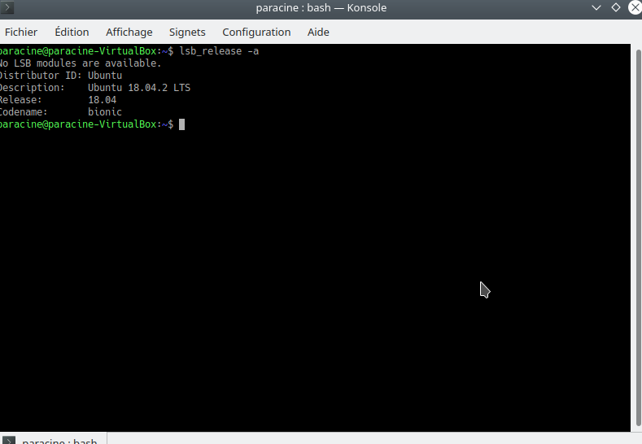

# Ubuntu

## Étapes post-installation Ubuntu 20.04

```shell script
sudo apt update
sudo apt upgrade
sudo apt install git yakuake filezilla golang steam-installer
sudo apt install apache2 mysql-server php phpmyadmin postgresql php-pgsql sqlite3
```

### Configurer mySQL

#### Créer un nouvel utilisateur avec droits admin

```shell script
sudo mysql
```

```mysql
# https://doc.ubuntu-fr.org/mysql
CREATE USER 'nom_utilisateur'@'localhost' IDENTIFIED WITH mysql_native_password BY 'mot_de_passe_solide';
GRANT ALL ON *.* TO 'nom_utilisateur'@'localhost';
```

### Configurer postgreSQL

Pour se [créer un utilisateur avec les droits sur une base](../../logiciels/postgresql/postgresql.md#crer-un-nouvel-utilisateur-super-admin-avec-sa-table-correspondante).

### Importer FileZilla

Importer le fichier de paramètres.

### Installer steam

Le paquet de l'installateur de steam a déjà été téléchargé et installé. Il
suffit de lancer steam une fois pour achever l'installation.

```shell script
steam
``` 

### Configuration générale

Remplacer le lanceur d'applications par un menu d'applications.

Raccourcis barre de lacement :
- Konsole
- Firefox
- Ktorrent
- FileZilla
- Dolphin
- Steam

Configurer la souris pour ouvrir les dossiers d'un simple clic (Espace de travail).

### Configurer Yakuake

- hauteur : 30%
- largeur : 90%
- thême : Breeze Perfect Dark

[Monter automatiquement les autres disques durs](../../logiciels/fstab/fstab.md#monter-automatiquement-un-disque-au-dmarrage)

### Installer d'autres logiciels

Installer les logiciels suivants :
- [CLion](https://www.jetbrains.com/clion/)
- [GoLand](https://www.jetbrains.com/go/)
- [IntelliJ IDEA](https://www.jetbrains.com/idea/)
- [PhpStorm](https://www.jetbrains.com/phpstorm/)
- [PyCharm](https://www.jetbrains.com/pycharm/)
- [WebStorm](https://www.jetbrains.com/webstorm/)

Options à modifier :

- modifier le clavier : French (alt. Latin-9 only)


## Connaître sa version d'Ubuntu

En ligne de commande, il suffit de :

```bash
lsb_release -a
```

Ce qui nous donnera :



## Monter automatiquement un disque dur

voir [ici](../../logiciels/fstab/fstab.md#monter-automatiquement-un-disque-au-dmarrage)

## Supprimer un dépôt

Les dépôts peuvent êtere à deux endroits différents :
- dans le dossier _/etc/apt/sources.list.d/_ où chaque fichier corrrespond
à un dépôt. Supprimer le fichier supprimera le dépôt de votre liste.
- dans le fichier _/etc/apt/sources.list_ où les adresses des dépôts se
succèdent ligne à ligne. Supprimer la ligne du dépôt en question le supprimera
de votre liste.